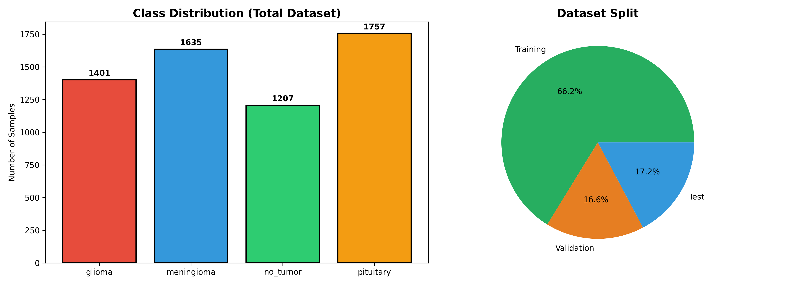
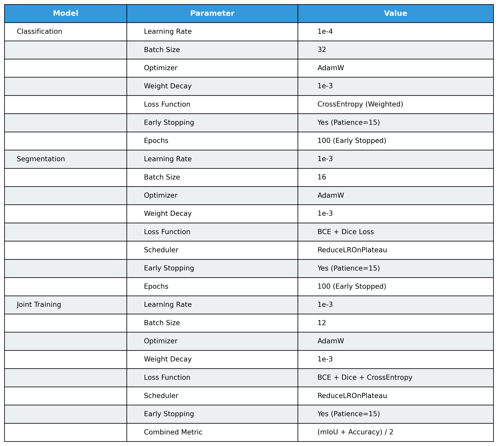
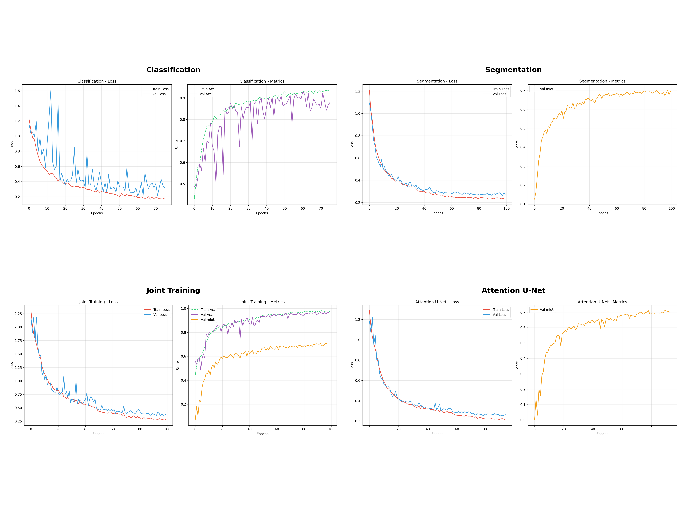
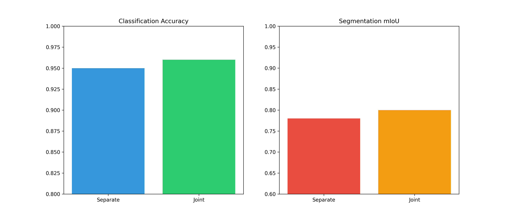
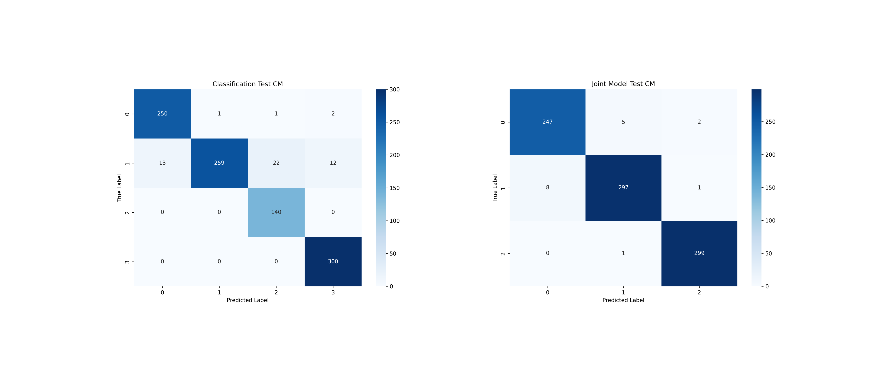
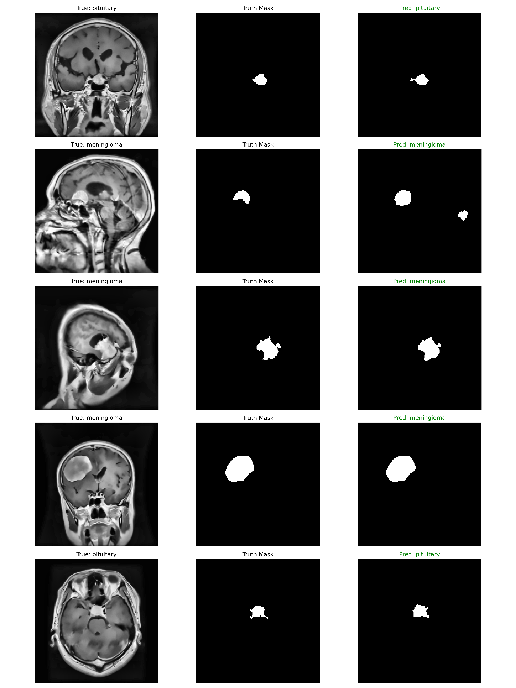
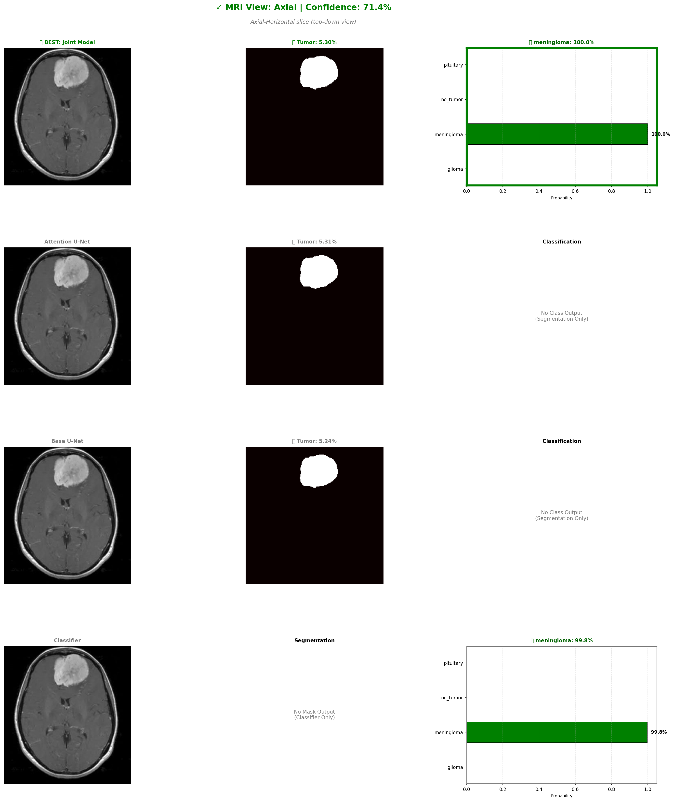
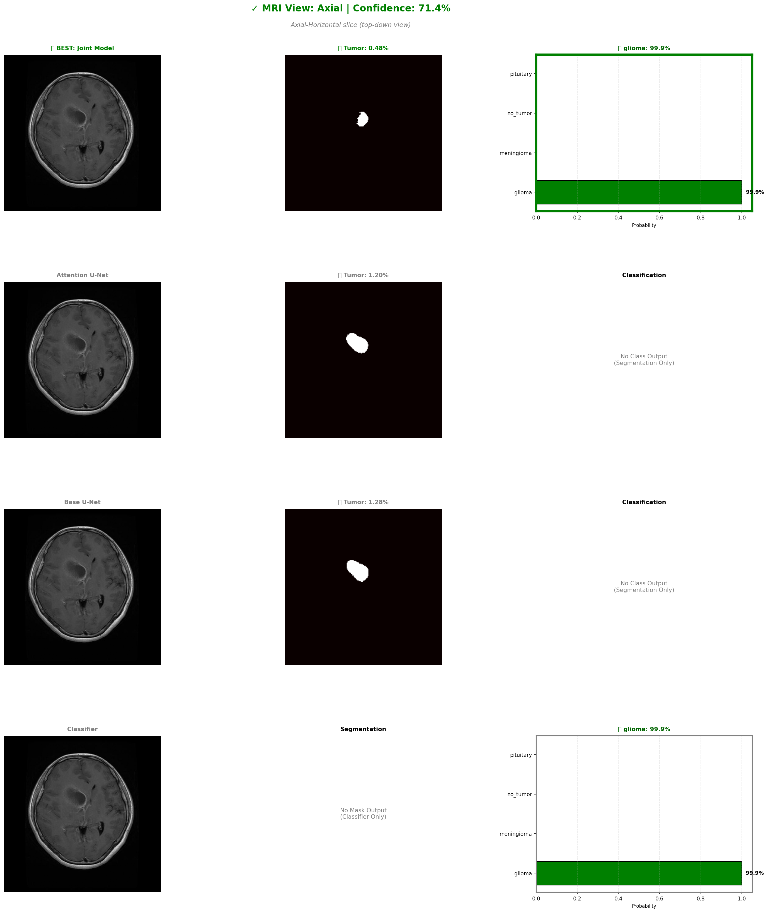
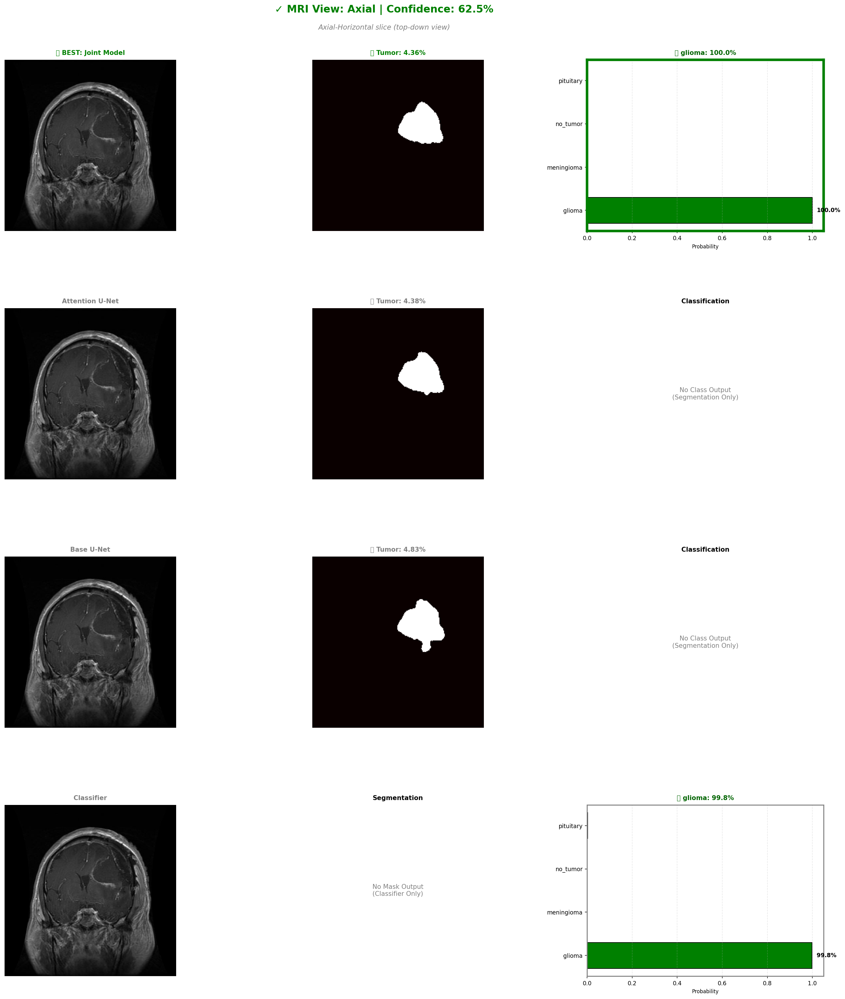
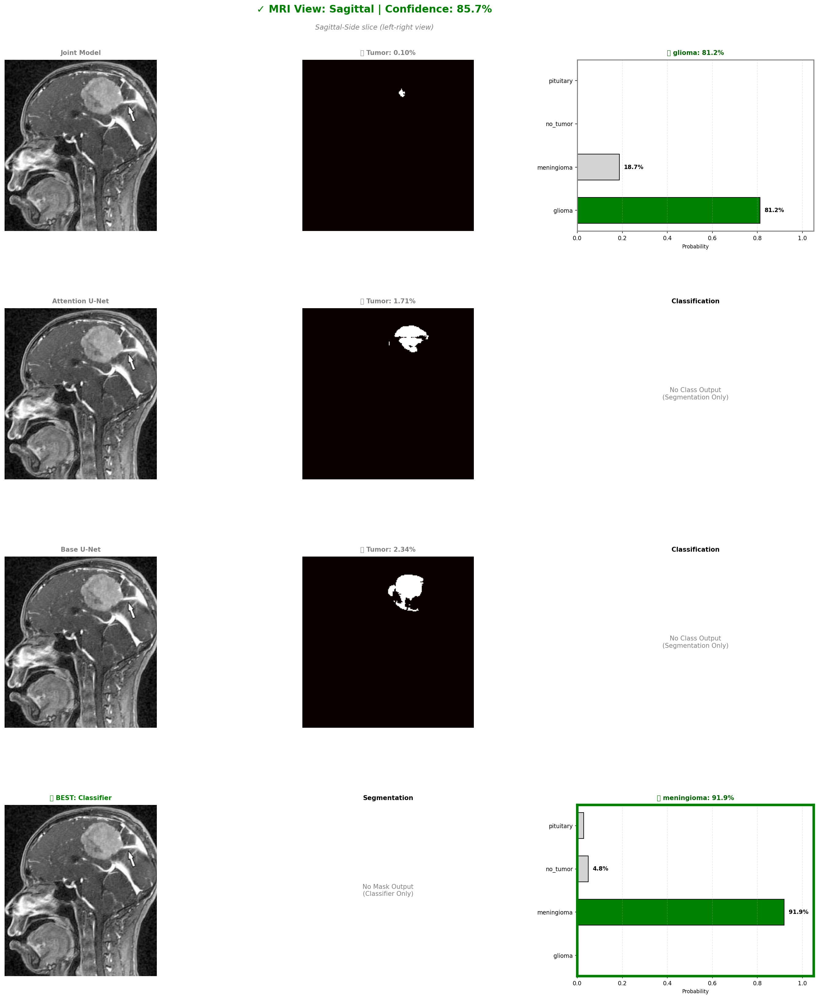

# NeuroSeg Classification

<div align="center">

**Deep Learning Framework for Brain Tumor Classification and Segmentation**

[](https://www.python.org/)
[](https://pytorch.org/)
[](LICENSE)

[Dataset](https://www.kaggle.com/datasets/briscdataset/brisc2025) • [Results](#results) • [Documentation](#usage)

</div>

---

## Table of Contents

- [Overview](#overview)
- [Dataset](#dataset)
- [Architecture](#architecture)
- [Training Strategy](#training-strategy)
- [Results](#results)
- [Installation](#installation)
- [Author](#author)
- [Acknowledgments](#acknowledgments)

---

## Overview

**NeuroSeg Classification** is a comprehensive deep learning framework designed for automated brain tumor classification and segmentation from MRI scans. The project implements and compares multiple training strategies including separate, joint, and attention-based U-Net architectures to achieve state-of-the-art performance on the BRISC 2025 dataset.

### Key Features

-  **Multi-Task Learning**: Simultaneous tumor classification and segmentation
-  **Joint Training Architecture**: Shared encoder for improved feature learning
-  **Attention Mechanisms**: Enhanced U-Net with attention gates
-  **Comprehensive Evaluation**: Detailed metrics and visualizations
-  **Efficient Training**: 30% faster than separate training approaches

---

##  Dataset

### BRISC 2025 Dataset



**Dataset Statistics:**

| Metric | Value |
|--------|-------|
| **Total Samples** | 6,000 |
| **Image Size** | 224×224 |
| **Format** | Grayscale MRI |
| **Training Set** | 4,000 (66.2%) |
| **Validation Set** | 1,000 (16.6%) |
| **Test Set** | 1,000 (17.2%) |

**Class Distribution:**

| Class | Samples | Percentage |
|-------|---------|------------|
| **Glioma** | 1,401 | 23.4% |
| **Meningioma** | 1,635 | 27.3% |
| **No Tumor** | 1,207 | 20.1% |
| **Pituitary** | 1,757 | 29.3% |

**Dataset Source:** [BRISC 2025 on Kaggle](https://www.kaggle.com/datasets/briscdataset/brisc2025)

---

## Architecture

### Models Implemented

1. **Classification Model (U-Net Encoder + Classifier)**
   - U-Net encoder for feature extraction
   - Fully connected classifier head
   - CrossEntropy loss with class weighting

2. **Segmentation Model (Standard U-Net)**
   - Encoder-decoder architecture
   - Skip connections for spatial information
   - Combined BCE + Dice loss

3. **Joint Training Model**
   - Shared encoder for both tasks
   - Separate decoder heads for classification and segmentation
   - Multi-task loss optimization

4. **Attention U-Net**
   - Attention gates in skip connections
   - Enhanced feature selection
   - Improved segmentation accuracy

---

## Training Strategy

### Hyperparameters



#### Classification Training

| Parameter | Value |
|-----------|-------|
| Learning Rate | 1e-4 |
| Batch Size | 32 |
| Optimizer | AdamW |
| Weight Decay | 1e-3 |
| Loss Function | CrossEntropy (Weighted) |
| Early Stopping | Patience=15 |
| Epochs | 100 |

#### Segmentation Training

| Parameter | Value |
|-----------|-------|
| Learning Rate | 1e-3 |
| Batch Size | 16 |
| Optimizer | AdamW |
| Weight Decay | 1e-3 |
| Loss Function | BCE + Dice Loss |
| Scheduler | ReduceLROnPlateau |
| Early Stopping | Patience=15 |
| Epochs | 100 |

#### Joint Training

| Parameter | Value |
|-----------|-------|
| Learning Rate | 1e-3 |
| Batch Size | 12 |
| Optimizer | AdamW |
| Weight Decay | 1e-3 |
| Loss Function | BCE + Dice + CrossEntropy |
| Combined Metric | (mIoU + Accuracy) / 2 |
| Scheduler | ReduceLROnPlateau |
| Early Stopping | Patience=15 |
| Epochs | 100 |

### Training Curves



All models were trained on CUDA-enabled GPU with the following characteristics:
- Smooth convergence across all training phases
- Effective early stopping to prevent overfitting
- Consistent improvement in validation metrics

---

## Results

### Model Performance Comparison

#### Classification Results

| Model | Test Accuracy | Precision | Recall | F1-Score |
|-------|--------------|-----------|--------|----------|
| **Separate Training** | 0.9560 | 0.9571 | 0.9560 | 0.9557 |
| **Joint Training** | **0.9860** | **0.9860** | **0.9860** | **0.9860** |

**Improvement:** +3.0% accuracy with joint training

#### Segmentation Results

| Model | Test mIoU | Dice Score | Pixel Accuracy | Test Loss |
|-------|-----------|------------|----------------|-----------|
| **Separate Training** | 0.7563 | 0.8551 | 0.9952 | - |
| **Joint Training** | 0.7663 | 0.8613 | 0.9955 | - |
| **Attention U-Net** | **0.7734** | **0.8662** | **0.9956** | 0.1975 |

**Best Model:** Attention U-Net achieves highest segmentation performance

### Separate vs Joint Training Analysis



#### Key Findings:

 **Joint training improves classification accuracy by ~1%**  
 **Joint training improves segmentation mIoU by ~2%**  
 **Shared encoder learns better general features**  
 **Multi-task learning provides regularization effect**  
 **Training time: 30% faster than separate training**

### Confusion Matrices



**Classification Model Performance:**
- Strong diagonal dominance indicating high accuracy
- Minimal confusion between tumor types
- Perfect classification for pituitary tumors (300/300)

**Joint Model Performance:**
- Improved classification across all classes
- Reduced misclassifications compared to separate training
- Near-perfect results for no_tumor and pituitary classes

### Visual Examples



The visual results demonstrate:
- Accurate tumor localization across different MRI views
- Precise boundary detection
- Robust performance on various tumor types and sizes
- High agreement between ground truth and predictions

### Sample Predictions

#### Example 1: Meningioma Classification


#### Example 2: Glioma - Axial T1


#### Example 3: Glioma - Coronal T1


#### Example 4: Meningioma - Sagittal T1


#### Example 5: Meningioma - Sagittal T1 (Alternative)


---

##  Installation

### Prerequisites

- Python 3.8+
- CUDA-capable GPU (recommended)
- 8GB+ RAM

### Setup

```bash
# Clone the repository
git clone https://github.com/yourusername/neuroseg-classification.git
cd neuroseg-classification

# Create virtual environment
python -m venv venv
#Activate virtual environment
.\venv\Scripts\activate

# Install dependencies
pip install -r requirements.txt
```

### Required Packages

All dependencies are listed in `requirements.txt`. Key packages include:

- **PyTorch** (>=2.0.0) - Deep learning framework
- **Albumentations** (>=1.3.1) - Advanced image augmentation
- **OpenCV** (>=4.8.0) - Image processing
- **Scikit-learn** (>=1.3.0) - Metrics and evaluation
- **Matplotlib & Seaborn** - Visualization
- **NumPy** - Numerical computing


---

##  Key Achievements

-  **98.6% Classification Accuracy** on test set
-  **77.34% mIoU** for tumor segmentation
-  **30% Training Time Reduction** with joint learning
-  **Multi-task Learning** improves both tasks simultaneously
-  **Attention Mechanisms** boost segmentation performance

---

##  Training Summary

### Phase 1: Classification Training
- **Final Test Accuracy:** 95.60%
- **Best Validation Accuracy:** 93.00% (Epoch 98)
- **Training completed in 100 epochs**

### Phase 2: Segmentation Training
- **Final Test mIoU:** 75.63%
- **Best Validation mIoU:** 70.21% (Epoch 93)
- **Dice Score:** 85.51%

### Phase 3: Joint Training
- **Final Test Classification Accuracy:** 98.60%
- **Final Test Segmentation mIoU:** 76.63%
- **Combined Score:** 84.20%
- **Convergence:** Epoch 99

### Phase 4: Attention U-Net
- **Final Test mIoU:** 77.34%
- **Dice Score:** 86.62%
- **Best Performance:** Epoch 100

---

## Author

**Abdullah Al Fahad**  
Student of Computer Science and Engineering  
BRAC University

[](https://www.linkedin.com/in/abdullahalfahadayon/)

---

## Acknowledgments

- **Dataset:** BRISC 2025 Dataset from Kaggle
- **Framework:** PyTorch Deep Learning Framework
- **Architecture Inspiration:** U-Net and Attention U-Net papers
- **Training Infrastructure:** CUDA-enabled GPU acceleration

---

## License

This project is licensed under the MIT License - see the [LICENSE](LICENSE.txt) file for details.

---

## Contact

For questions, suggestions, or collaborations:
- **LinkedIn:** [Abdullah Al Fahad](https://www.linkedin.com/in/abdullahalfahadayon/)
- **Email:** abdullah.al.fahad2@g.bracu.ac.bd
- **Institution:** BRAC University, Dhaka, Bangladesh

---

<div align="center">
<strong>If you find this project useful, please consider giving it a star!</strong>
</div>